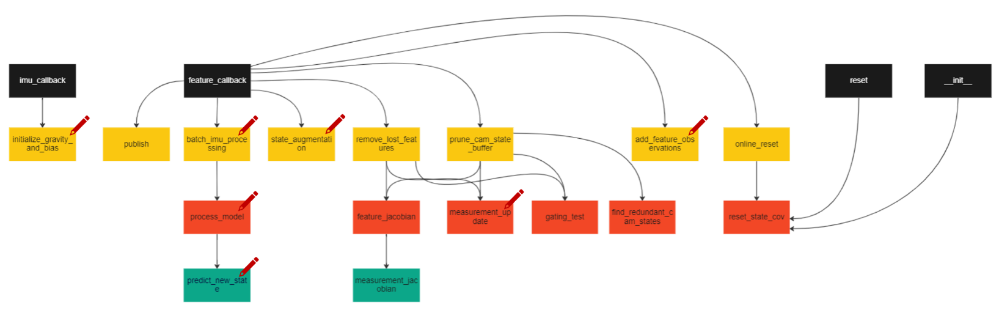

# msckf_vio_python
MSCKF (Multi-State Constraint Kalman Filter) implementation in Python

MSCKF (Multi-State Constraint Kalman Filter) is an EKF based **tightly-coupled** visual-inertial odometry algorithm. [S-MSCKF](https://arxiv.org/abs/1712.00036) is MSCKF's stereo version. This project is a Python reimplemention of S-MSCKF, the code is directly translated from official C++ implementation [KumarRobotics/msckf_vio](https://github.com/KumarRobotics/msckf_vio).  
 
Another algorithm for getting VIO is implemented by using Error State Kalman filter (ESKF) [here](https://github.com/rohiitb/Quadrotor_planning_and_control).

### Difference between ESKF and MSCKF

The main difference between ESKF and MSCKF is in how they handle the uncertainty and measurement noise. ESKF models the uncertainty in the 6 DOF pose as a covariance matrix and updates it using the Kalman filter framework. This approach works well when the object moves slowly and the IMU measurements are relatively stable. However, when the object moves rapidly or experiences high levels of noise, the covariance matrix can grow quickly and lead to drift in the estimated pose.

MSRKF, on the other hand, maintains a set of states representing the camera poses and IMU states, and a set of constraints derived from the feature observations and IMU measurements. The algorithm uses these constraints to eliminate inconsistencies and produce a more accurate and robust estimate of the pose. MSRKF is better suited to handling rapid motion and high levels of noise compared to ESKF.

For algorithm details, please refer to:
* Robust Stereo Visual Inertial Odometry for Fast Autonomous Flight, Ke Sun et al. (2017) [Link](https://arxiv.org/abs/1712.00036)
* A Multi-State Constraint Kalman Filterfor Vision-aided Inertial Navigation, Anastasios I. Mourikis et al. (2006) [Link](https://www-users.cse.umn.edu/~stergios/papers/ICRA07-MSCKF.pdf) 

### Structure

## Requirements
* Python 3.6+
* numpy
* scipy
* cv2
* [pangolin](https://github.com/uoip/pangolin) (optional, for trajectory/poses visualization)

## Dataset
* [EuRoC MAV](http://projects.asl.ethz.ch/datasets/doku.php?id=kmavvisualinertialdatasets): visual-inertial datasets collected on-board a MAV. The datasets contain stereo images, synchronized IMU measurements, and ground-truth.  
This project implements data loader and data publisher for EuRoC MAV dataset.

## Run  
`python vio.py --view --path path/to/your/EuRoC_MAV_dataset/MH_01_easy`  
or    
`python vio.py --path path/to/your/EuRoC_MAV_dataset/MH_01_easy` (no visualization)  

## Results
MH_01_easy  

## License and References
Follow [license of msckf_vio](https://github.com/KumarRobotics/msckf_vio/blob/master/LICENSE.txt).
