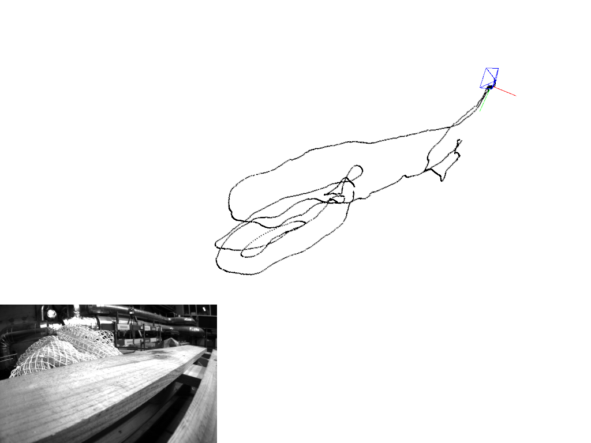

# Stereo MSCKF Starter Code for [WPI's](https://www.wpi.edu/) [RBE/CS549](https://nitinjsanket.github.io/teaching/rbe549/fall2022.html) by [Prof. Nitin J. Sanket](https://nitinjsanket.github.io/)
See [the course website](https://nitinjsanket.github.io/teaching/rbe549/fall2022.html) for more details. The code was modified by [Dr. Lening Li.](https://lening.li/)

MSCKF (Multi-State Constraint Kalman Filter) is an EKF based **tightly-coupled** visual-inertial odometry algorithm. [S-MSCKF](https://arxiv.org/abs/1712.00036) is MSCKF's stereo version. This project is a Python reimplemention of S-MSCKF, the code is directly translated from official C++ implementation [KumarRobotics/msckf_vio](https://github.com/KumarRobotics/msckf_vio).  

For algorithm details, please refer to:
* Robust Stereo Visual Inertial Odometry for Fast Autonomous Flight, Ke Sun et al. (2017)
* A Multi-State Constraint Kalman Filterfor Vision-aided Inertial Navigation, Anastasios I. Mourikis et al. (2006)  

## Requirements
* Python 3.6+
* numpy
* scipy
* cv2
* [pangolin](https://github.com/uoip/pangolin) (optional, for trajectory/poses visualization)

## Dataset
* [EuRoC MAV](http://projects.asl.ethz.ch/datasets/doku.php?id=kmavvisualinertialdatasets): visual-inertial datasets collected on-board a MAV. The datasets contain stereo images, synchronized IMU measurements, and ground-truth.  
This project implements data loader and data publisher for EuRoC MAV dataset.

## Run  
`python vio.py --view --path path/to/your/EuRoC_MAV_dataset/MH_01_easy`  
or    
`python vio.py --path path/to/your/EuRoC_MAV_dataset/MH_01_easy` (no visualization)  

## Results
MH_01_easy  

## License and References
Follow [license of msckf_vio](https://github.com/KumarRobotics/msckf_vio/blob/master/LICENSE.txt). Code is adapted from [this implementation](https://github.com/uoip/stereo_msckf).